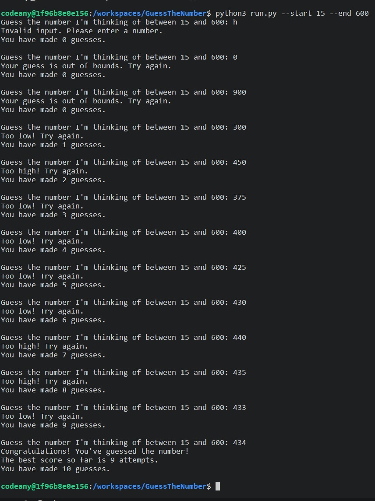

# Guess The Number Game

## Overview
This project is a simple, console-based game where a user is tasked with guessing a random number within a user-defined or deafault range. The game includes a leaderboard feature that keeps track of the fewest number of guesses needed to find the correct number.
## Features 

- **User-Defined Number Range**: The user has the option to define their preferred range within which a random number will be generated for guessing (default is 1-100).
- **Random Number Generation**: The game generates a random number within the specified range for the user to guess.
- **Input Validation**: The game validates user inputs to ensure they are numerical and within the specified range.
- **Guess Evaluation**: The game provides feedback to the user if their guess is too high, too low, or correct.
- **Leaderboard**: The game keeps track of the number of guesses made and saves this to a leaderboard.
## Existing Features
All features described above are currently implemented and operational.
## User Experience (UX)
This game provides a straightforward user experience. Users can define their preferred range for the random number, guess a number within this range, and receive immediate feedback on their guess.
## Site Goals

The main goal of this game is to provide a simple and engaging opportunity for users to play and have fun. It aims to test and improve the user's intuitive reasoning and guessing abilities while providing them the flexibility to define their own number range.

## Compatibility and Responsiveness Testing

 The application's Python code has been verified with [PEP 8 online validator](https://pep8ci.herokuapp.com/) and [Python Checker](https://www.pythonchecker.com/), passing all checks successfully. This process confirmed that the code complies with Python's PEP 8 style guide and is free from syntax errors, logical issues, and runtime errors.
## Manual Testing

Manual testing was done on various features of the console game to ensure it works as expected.

| Feature                     | Expectation                                               | Action                                                       | Result                                         |
|-----------------------------|------------------------------------------------------------|--------------------------------------------------------------|------------------------------------------------|
| Game start                  | Game prompts for a number guess within the specified range | Started the game                                             | Game started correctly, prompt was displayed  |
| Input within range          | Accepts number and compares it to the target               | Entered a number within the specified range                  | Number was accepted and correctly evaluated   |
| Input outside range         | Warns about out-of-range input                             | Entered a number outside the specified range                 | Out-of-range warning was correctly displayed  |
| Non-number input            | Warns about invalid input                                  | Entered a non-number input                                   | Invalid input warning was correctly displayed |
| Correct guess               | Congratulates the player and updates the leaderboard       | Guessed the target number                                    | Game correctly ended, leaderboard was updated |
| Command-line arguments      | Game starts with the specified number range                | Started the game with command-line arguments for number range| Game started with correct number range        |
| Leaderboard after game end  | Shows the best score so far                                | Checked the leaderboard after the game ended                 | Correct best score was shown                 |
| Game on different platforms | Game runs without errors                                   | Ran the game on different platforms                          | Game ran successfully without errors          |
## Manual Testing of User Stories

### Expectation

A user wants to play a simple but engaging game to test their guessing skills.

### Result

As a user, I found a game that asks me to guess a number within a certain range, providing a simple yet engaging way to test my guessing skills.

### Expectation

A user wants to know how many attempts it took them to guess the correct number.

### Result

As a user, I was told how many guesses I made after I guessed the number correctly, giving me an insight into my guessing accuracy.

### Expectation

A user wants to have the option to define their preferred range within which a random number will be generated for guessing.

### Result

As a user, I found the feature to set my preferred number range using command-line arguments, giving me flexibility in defining the difficulty level.

### Expectation

A user wants to be informed when they guess a number outside the defined range.

### Result

As a user, I received an out-of-range warning when I guessed a number outside the defined range, ensuring I stay within the correct bounds.

### Expectation

A user wants to keep track of their best performance.

### Result

As a user, I found the leaderboard feature that shows the best score so far, helping me track my performance over time.

### Expectation

A user wants to play the game on different platforms.

### Result

As a user, I found that the game runs smoothly on multiple platforms, including Windows, Linux, and macOS, allowing me to play the game on my preferred platform.
## Deployment

The project was deployed to Heroku using the following steps:

1. Create a new application on the Heroku dashboard.

2. Choose a unique name for the application, select the region, and click on "Create App".

3. In the Heroku app settings, add Python and Node.js buildpacks. The ordering is as follows:
    1. heroku/python
    2. heroku/nodejs

4. Add a new Config Var called PORT and set it to 8000.

5. Update or create a `requirements.txt` file in your project root directory. This file tells Heroku which packages are required to run your app. If you need to create this, you can do so by running `pip freeze > requirements.txt` in the terminal. If you already have a `requirements.txt` file, make sure to update it with any new dependencies before the next steps.

6. Commit the `requirements.txt` file to your repository.

7. Connect your Heroku app to the corresponding GitHub repository.

8. Choose the branch to deploy and click on "Enable Automatic Deploys" when want Heroku to rebuild the app every time you push to this branch.

9. Click on "Deploy Branch".

10. Once the app is built, click on "Open app" to open your newly deployed app.
## Heroku Deployment Limitations
This game, designed for a console environment, has been deployed on Herokun. However, Heroku's nature as a web app hosting platform restricts certain console-specific features. Users cannot specify the random number range on Heroku due to its lack of support for Python's `input()` function. Consequently, the game on Heroku uses a default range (1-100). Additionally, due to Heroku's ephemeral filesystem, the leaderboard feature may not function as expected. For the full gaming experience, it is recommended to run the game locally.

## Credits

### Content

- The concept for developing the geim was inspired by [makeuseof.com](https://www.makeuseof.com/number-guessing-game-using-python), [pythonguides.com](https://pythonguides.com/python-number-guessing-game/)
- The instructions how to create players rating were taken from [stackoverflow.com](https://ru.stackoverflow.com/questions/1351934/%D1%83%D0%B3%D0%B0%D0%B4%D0%B0%D0%B9-%D1%87%D0%B8%D1%81%D0%BB%D0%BE-%D0%BD%D0%B0-python-%D1%81-%D0%B7%D0%B0%D0%BF%D0%B8%D1%81%D1%8C%D1%8E-3-%D0%BB%D1%83%D1%87%D1%88%D0%B8%D1%85-%D1%80%D0%B5%D0%B7%D1%83%D0%BB%D1%8C%D1%82%D0%B0%D1%82%D0%BE%D0%B2)
- The instructions for creating README file were taken from CodeInstitute Educational materials. [CodeInstituteREADME template](https://github.com/Code-Institute-Solutions/readme-template), Codeinstitute README presentation and [markdownlivepreview](https://markdownlivepreview.com/).
- I would like to acknowledge the beginner resources for front-end at [W3Schools](https://w3schools.com) and extensive notes and tips hosted by the [Mozilla Foundation](developer.mozilla.org).
- I would like to acknowledge the resources provided by [Openais ChatGPT](https://chat.openai.com/?model=gpt-4), which proved invaluable for problem-solving and getting suggestions throughout the development process.

### Media

- The screenshot for the README documentation was self-created and taken from the console.

## Languages Used

- [Python](https://www.python.org/)

## Frameworks, Libraries & Programs Used

- [random](https://docs.python.org/3/library/random.html): for generating random numbers
- [json](https://docs.python.org/3/library/json.html): for storing and retrieving leaderboard data
- [argparse](https://docs.python.org/3/library/argparse.html): for handling command-line arguments and allowing the user to define the range of numbers
## Acknowledgements
- To Kay Welfare, for providing great psyhological support and motivation.
- To my mentor Antonio Rodriguez for helping to resolve the technical questions.
- I would like to mentions Openais ChatGPT, which gave me a huge opportunity to study quick and very efficient.