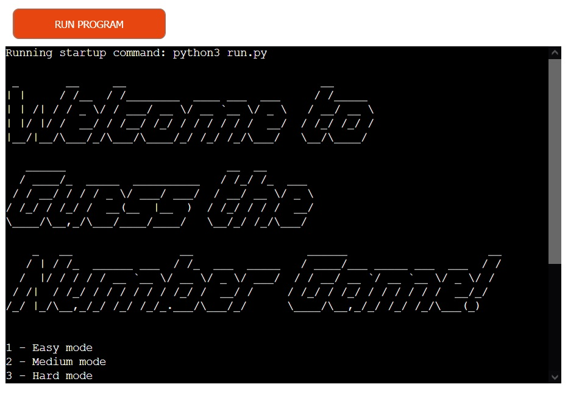

# Guess The Number Game

## Overview

"Guess the Number" is a simple, yet engaging game that tests user's deductive reasoning and luck. The players are challenged to guess a randomly generated number within a specified range. It's not just a game of chance, but also a challenge for logic and intuition. 
Players can opt for easy, medium, or hard difficulty levels .
The game also includes a leaderboard feature that keeps track of the best scores. 
## How to Play 'Guess The Number Game'
- Run the script to start the game.
- You will be asked to select a difficulty level:
   - Easy mode: Guess a number between 1 and 20.
   - Medium mode: Guess a number between 1 and 100.
   - Hard mode: Guess a number between -1000 and -1.
- Guess the number. You will be informed if your guess is too high, too low, or correct.
- If you guess correctly, you will be told how many guesses you took, and this score will be compared to the leaderboard for the selected difficulty level.
- After a game finishes, you will be asked if you want to play again.
Enjoy the game!
## Leaderboard
The game includes a leaderboard feature for each difficulty level. The leaderboard records the lowest number of guesses a player has taken to correctly guess the number.
## Requirements
- Python 3.6+
- Libraries: 'pyfiglet', 'colorama'
## Running the Game in the Command Line
Run the script in the command line by typing 'python3 run.py'
## Play Online
The game is hosted on Heroku and can be played online at [this link](https://guess-my-number-cf1fa4bffe60.herokuapp.com/).

## Features 
- **Title**: When the users enter the site they are greeted with a very simple page welcoming text created using Pyfiglet which takes ASCII text and renders it into ASCII fonts.

- **Dynamic Difficulty Levels**: The user can select between easy, medium, or hard difficulty levels, each offering a different number guessing range.
- **Random Number Generation**: The game generates a random number within the selected difficulty range for the user to guess.
- **Input Validation**: The game validates user inputs to ensure they are numerical and within the specified range.

- **Feedback System**: The game provides immediate feedback to the user if their guess is too high, too low, or correct.
- **Play Again Prompt**: After a game ends, the user is asked if they want to play again, providing continuous play without needing to restart the program.

- **Leaderboard System**: The game keeps track of the number of guesses made for each difficulty and saves the best score of each level in a leaderboard.json file.

## User Experience (UX)
The game offers a user-friendly experience. Users can choose their preferred difficulty level, guess a number within the respective range, and receive immediate feedback on their guesses. The use of color-coding enhances readability and user engagement. The game provides a sense of progression and challenge by tracking the best score for each difficulty level in a leaderboard.

## Site Goals

The main goal of this game is to provide a simple and engaging opportunity for users to play and have fun. It aims to test and improve the user's intuitive reasoning and guessing abilities while providing them the flexibility to define their own number range.

## Compatibility and Responsiveness Testing

 The application's Python code has been verified with [PEP 8 online validator](https://pep8ci.herokuapp.com/) and [Python Checker](https://www.pythonchecker.com/), passing all checks successfully. This process confirmed that the code complies with Python's PEP 8 style guide and is free from syntax errors, logical issues, and runtime errors.

## Manual Testing

| Feature                     | Expectation                                               | Action                                                       | Result                                         |
|-----------------------------|------------------------------------------------------------|--------------------------------------------------------------|------------------------------------------------|
| Game initiation             | Game prompts for difficulty level selection               | Initiated the game                                           | Game started correctly, prompt was displayed  |
| Difficulty level selection  | Accepts choice and sets appropriate number range          | Selected a difficulty level                                  | Difficulty level was accepted, and number range was correctly set |
| Input within range          | Accepts number and compares it to the target               | Entered a number within the specified range                  | Number was accepted and correctly evaluated   |
| Input outside range         | Warns about out-of-range input                             | Entered a number outside the specified range                 | Out-of-range warning was correctly displayed  |
| Non-number input            | Warns about invalid input                                  | Entered a non-number input                                   | Invalid input warning was correctly displayed |
| Correct guess               | Congratulates the player, updates the leaderboard, and prompts to play again | Guessed the target number                                    | Game correctly ended, leaderboard was updated, and play again prompt was shown |
| Leaderboard after game end  | Shows the best score so far for each difficulty level      | Checked the leaderboard after the game ended                 | Correct best score for each difficulty level was shown                 |
| Game restart                | Game restarts with a new number range when play again option is chosen | Chose to play again after a game ended | Game restarted correctly with a new number range |
| Game termination            | Game ends gracefully when play again option is declined    | Declined to play again after a game ended | Game ended correctly with a gratitude message |

## Manual Testing of User Stories

- Expectation

  A user wants to play a simple but engaging game to test their guessing skills with varying levels of difficulty.

- Result

  As a user, I found a game that asks me to guess a number within a certain range based on the selected difficulty level, providing a simple yet engaging way to test my guessing skills.

- Expectation

  A user wants to know how many attempts it took them to guess the correct number.

- Result

  As a user, I was told how many guesses I made after I guessed the number correctly, giving me an insight into my guessing accuracy.

- Expectation

  A user wants to have the option to play the game at different difficulty levels, each with a distinct range of numbers.

- Result

  As a user, I found the feature to select my preferred difficulty level, which determines the range of numbers for guessing. This provided me with varied levels of challenge and kept the game engaging.

- Expectation

  A user wants to be informed when they guess a number outside the defined range.

- Result

  As a user, I received an out-of-range warning when I guessed a number outside the defined range, ensuring I stay within the correct bounds.

- Expectation

  A user wants to keep track of their best performance for each difficulty level.

- Result

  As a user, I found the leaderboard feature that shows the best score so far for each difficulty level, helping me track my performance over time.

- Expectation

  A user wants clear and visually appealing feedback on their guesses.

- Result

  As a user, I found that the game provides color-coded feedback on my guesses, enhancing readability and visual appeal.

## Other Game Testing

- **Random Number Generation:** Each time a new game started, a different random number was selected within the defined range. This was verified by playing multiple games and observing the target number.

- **Text Colour:** The game uses different colours to provide feedback to the user, improving readability and overall user experience. Each type of message (instructions, error messages, success messages) displayed in the console has a unique colour, making them easily distinguishable.

- **Play Again Option:** After the user guesses the number correctly, the game asks if the user wants to play again. This was tested by guessing the correct number and observing the game's response. The game correctly offers the option to play again and starts a new game if the user chooses to do so.

- **Input Validation:** The game correctly handles both non-number inputs and numbers outside the specified range. This was tested by entering various invalid inputs and observing the game's response.

- **Guess Evaluation:** The game correctly evaluates the user's guess and provides appropriate feedback, whether the guess is too high, too low, or correct. This was tested by entering various guesses and observing the feedback.

- **Leaderboard Functionality:** The game correctly tracks the user's score (number of guesses) and updates the leaderboard. This was tested by playing multiple games and observing the leaderboard.

## Logic Flow
1. Start
2. Player chooses difficulty level (Easy, Medium, Hard)
3. Game generates a random number within the range specified by the difficulty level
4. Game asks player for a guess
5. If the input is not a number, inform the player and go back to step 4
6. If the guess is not within the range, inform the player that the guess is out of bounds and go back to step 4
7. If the guess is lower than the target, inform the player that the guess is too low and go back to step 4
8. If the guess is higher than the target, inform the player that the guess is too high and go back to step 4
9. If the guess is correct, congratulate the player, update the leaderboard, and end the guessing part of the game
10. Ask the player if they want to play again
11. If the player wants to play again, go back to step 2
12. If the player doesn't want to play again, end.

## Data Model

I have applied principles of Object-Oriented Programming (OOP) throughout this project. The GuessTheNumberGame is organized around a single class:

    GuessTheNumberGame

The GuessTheNumberGame object is responsible for controlling the flow of the game. It manages activities like taking user input, generating random numbers, providing feedback, and updating the leaderboard. It includes methods for various stages of the game such as selecting the difficulty, validating guesses, providing feedback on guesses, updating the leaderboard, and asking the user to play again.

When the game is first run, the GuessTheNumberGame instance is created, and the select_difficulty method is called to allow the user to choose the difficulty level. This sets the range for the random number that the user will guess. Then, the play method is called to start the guessing game. User input is passed to the check_guess method where it's validated and used to determine whether the guess is too high, too low, or correct. If the guess is correct, the update_leaderboard method is called to update the leaderboard with the number of guesses made.

This modular approach to object definition means that all the functionality for running the game, checking the user's guess, and updating the leaderboard are all self-contained within the GuessTheNumberGame class. This makes it easier to develop, understand, and troubleshoot the code when things don't work as expected.

## Command-Line Arguments History

In the initial versions of this game, I had implemented command-line arguments using Python's built-in [argparse](https://docs.python.org/3/library/argparse.html) library. This feature allowed users to define the range of numbers to guess from directly from the command-line when starting the game, providing an extra layer of customization to the game's difficulty.

However, as the project evolved and the decision was made to deploy the game on Heroku, I realized that command-line arguments would not be applicable in a web-based environment. As a result, I made the choice to replace the command-line arguments feature with an in-game difficulty level selection. This change made the game more accessible to users on all platforms, including web, while maintaining the ability for users to define their own difficulty level by choosing the range of numbers to guess from.

## Use of Colorama

In order to make the game more visually engaging and enhance user experience, I incorporated the use of the [colorama](https://pypi.org/project/colorama/) library in the console outputs. This library allows for the easy use of colored terminal text and provides cross-platform compatibility. 

Different colors are used to indicate different outcomes - for example, green is used to indicate a successful guess, yellow is used for a guess that's too high or too low, and blue is used to indicate an invalid input or a guess that's out of bounds. These color cues help users understand the game feedback quickly and make the game more enjoyable to play.

## Bugs

During the development process, various bugs were encountered. However, through diligent testing and debugging, these issues were addressed and resolved.

### Remaining Bugs

There are currently no known bugs remaining in the game. However, if you encounter any issues during gameplay, please feel free to report them.

### Solved Bugs

**Bug 1**: Incorrect identification of game difficulty level in `update_leaderboard` function.
   - **Solution**: Updated the conditions in the `update_leaderboard` function to correctly identify the difficulty level based on the start and end values of the number range.

**Bug 2**: Unhandled error in `update_leaderboard` function about local variable `difficulty` being referenced before assignment.
   - **Solution**: Corrected the conditions in the `update_leaderboard` function to ensure that the `difficulty` variable is always defined before it is used.

**Bug 3**: Incompatibility of using command-line arguments with deployment on Heroku.
   - **Solution**: Removed the feature of using command-line arguments and replaced with a function to select difficulty levels, making the program compatible with Heroku.

**Bug 4**: The ASCII art generated by `pyfiglet` for the welcome message was not displayed when the game was deployed on Heroku.
   - **Solution**: Added `pyfiglet` to the `requirements.txt` file to ensure that it gets installed during the Heroku build process. This solved the issue, and the welcome message is now correctly displayed as ASCII art in the Heroku deployment.

**Bug 5**: The medium and hard difficulty levels were indistinguishable due to same maximum limit.
   - **Solution**: Adjusted the maximum limits for medium and hard levels to 100 and 1000 respectively, providing distinct ranges for each difficulty level.

**Bug 6**: After changing the difficulty level's min and max values, the game was still validating the user's guess based on the old values.
   - **Solution**: Updated the `check_guess` method to use the new min and max values for validating the user's guess. This fixed the bug and the game started validating the guesses correctly according to the selected difficulty level.

### Remaining Bugs

There are currently no known bugs remaining in the game. However, if you encounter any issues during gameplay, please feel free to report them.

### Remaining Bugs

There are currently no known bugs remaining in the game. However, if you encounter any issues during gameplay, please feel free to report them.

Please let me know if there's anything else you'd like to include in your README!

## Deployment

The project was deployed to Heroku using the following steps:

1. Create a new application on the Heroku dashboard.

2. Choose a unique name for the application, select the region, and click on "Create App".

3. In the Heroku app settings, add Python and Node.js buildpacks. The ordering is as follows:
    1. heroku/python
    2. heroku/nodejs

4. Add a new Config Var called PORT and set it to 8000.

5. Update or create a `requirements.txt` file in your project root directory. This file tells Heroku which packages are required to run your app. If you need to create this, you can do so by running `pip freeze > requirements.txt` in the terminal. If you already have a `requirements.txt` file, make sure to update it with any new dependencies before the next steps.

6. Commit the `requirements.txt` file to your repository.

7. Connect your Heroku app to the corresponding GitHub repository.

8. Choose the branch to deploy and click on "Enable Automatic Deploys" when want Heroku to rebuild the app every time you push to this branch.

9. Click on "Deploy Branch".

10. Once the app is built, click on 'Open app' to open your newly deployed app.

## Credits

### Content

- The concept for developing the game was inspired by [makeuseof.com](https://www.makeuseof.com/number-guessing-game-using-python), [pythonguides.com](https://pythonguides.com/python-number-guessing-game/)
- The instructions how to save the best score were taken from [stackoverflow.com](https://stackoverflow.com/questions/45301436/saving-down-onto-a-file-and-sorting-after-highest-score-python-games) and [stackoverflow.com](https://stackoverflow.com/questions/23110383/how-to-dynamically-build-a-json-object)
- The technique to color the console text was inspired by examples in the [stackoverflow.com](https://stackoverflow.com/questions/287871/how-do-i-print-colored-text-to-the-terminal) and  [colorama documentation](https://pypi.org/project/colorama/).
- the instruction how to generate random numbers in range from input was taken from [stackoverflow.com](https://stackoverflow.com/questions/39996814/how-to-generate-random-numbers-in-range-from-input)
- The instructions for creating README file were taken from CodeInstitute Educational materials. [CodeInstituteREADME template](https://github.com/Code-Institute-Solutions/readme-template), Codeinstitute README presentation and [markdownlivepreview](https://markdownlivepreview.com/).
- I would like to acknowledge the beginner resources for front-end at [W3Schools](https://w3schools.com) and extensive notes and tips hosted by the [Mozilla Foundation](developer.mozilla.org).
- I would like to acknowledge the resources provided by [Openais ChatGPT](https://chat.openai.com/?model=gpt-4), which proved invaluable for problem-solving and getting suggestions throughout the development process.

### Media

- The screenshots for the README documentation were self-created and taken from Heroku app and the console.

## Languages Used

- [Python](https://www.python.org/)

## Frameworks, Libraries & Programs Used

1. [random](https://docs.python.org/3/library/random.html): This built-in Python library is used for generating random numbers which are used as the target number for the guessing game.
2. [json](https://docs.python.org/3/library/json.html): Another built-in Python library used for storing and retrieving leaderboard data in JSON format.
3. [Pyfiglet](https://pypi.org/project/pyfiglet/0.8/): A Python library that converts ASCII text into ASCII art fonts, which is used to display the game's title in a more visually appealing format in the console.
4. [colorama](https://pypi.org/project/colorama/): A Python library used to colorize console output, improving the visual feedback provided to the user during the game.
5. [GitHub](https://github.com/): used for version control.
6. [Heroku](https://dashboard.heroku.com/apps):  used to deploy the live project.
7. [PEP8 Online](http://pep8online.com/): used to validate all the Python code

## Acknowledgements
- To Kay Welfare, for providing great psyhological support and motivation.
- To my mentor Antonio Rodriguez for helping to resolve the technical questions.
- I would like to mentions Openais ChatGPT, which gave me a huge opportunity to study quickly and very efficiently.
- To the Code Institute slack community.